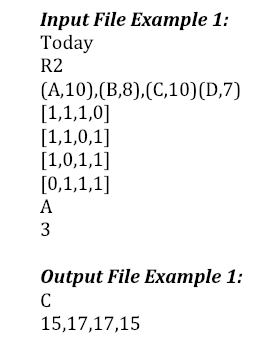
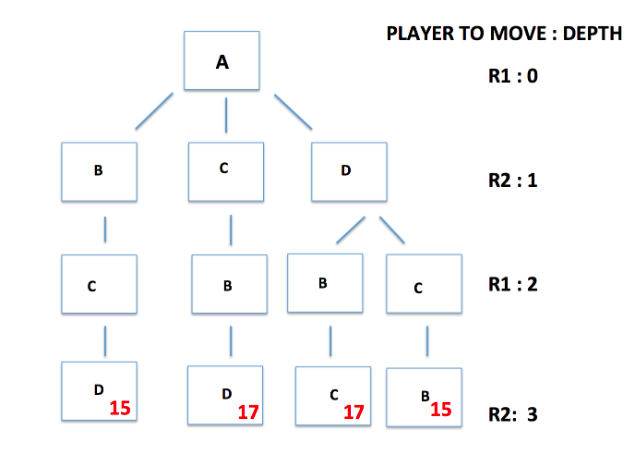

# Region Profitability Maximization

For assignment description, go to the docs/assignment-desc subfolder.

To run script:
Run the script with "src/RegionSelection.py -i test/[INPUT FILE]"

This program is an example of an Alpha-Beta search. Two rideshare drivers take turns selecting which region they want to claim as their own. Each region has a profitability factor associated with it. The goal is for each player to maximize their profitability with their choices, with the assumption that the other player will pick the optimal region. The program constructs a search tree and searches it given the initial conditions, but does not search branches that have been eliminated by the alpha-beta pruning.

# Example input output and visualization of tree

